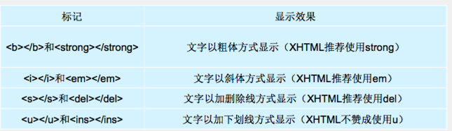
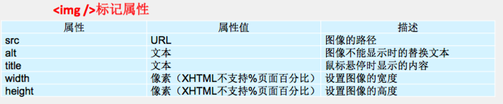
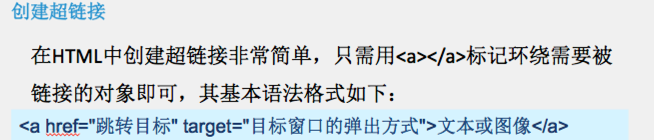
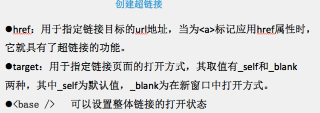

```
暂时没有确定链接目标时
通常将<a>标记的href属性值定义为“#”(即href="#")，表示该链接暂时为一个空链接。
```

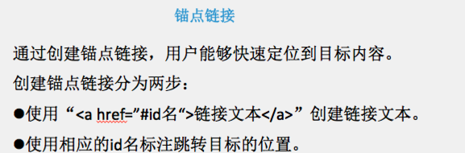
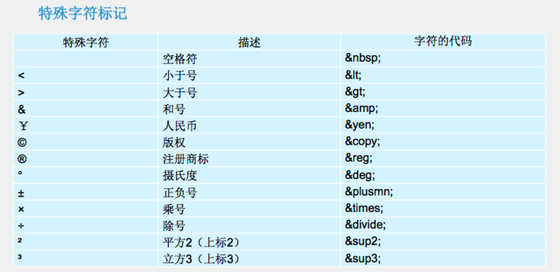

# 列表

## 无序列表 ul

- type: disic, square, circle

<div>
	<ul type="disic">
		<li>a</li>
		<li>b</li>
		<li>c</li>
	</ul>
</div>

<div>
	<ul type="square">
		<li>a</li>
		<li>b</li>
		<li>c</li>
	</ul>
</div>

<div>
	<ul type="circle">
		<li>a</li>
		<li>b</li>
		<li>c</li>
	</ul>
</div>

## 有序列表 ol

<div>
	<ol type=1 start=2>
		<li>a</li>
		<li>b</li>
		<li>c</li>
	</ol>
</div>

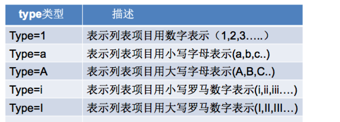

## 自定义列表

<div>
	<dl>
	 <dt>名词1</dt>
	 	<dd>名词1解释1</dd>
	 	<dd>名词1解释2</dd>
	 <dt>名词2</dt>
	 	<dd>名词2解释1</dd>
	 	<dd>名词2解释2</dd>
	</dl>
</div>

# meta 标签

- meta的属性有两种：name和http-equiv
	- name属性主要用于描述网页，对应于content(网页内容)

```
	<!-- 关键字, 搜索引擎 -->
	<meta name="keywords" content="Java培训,Android培训,安卓培训,PHP培训,C++培训,iOS培训,网页设计培训,平面设计培训,UI设计培训,游戏开发培训,移动开发培训,网络营销培训,web前端培训">

	<!-- 网页描述 搜索引擎-->
	<meta name="description" content="传智播客，据说是中国最靠谱的IT培训机构！">

	<!-- 网页作者, 搜索引擎-->
	<meta name="author" content="作者">

	<!-- 网页编码 -->
	<meta http-equiv="Content-Type"  content="text/html" charset="UTF-8">

	<!-- 网页重定向 -->
	<meta http-equiv="refresh"  content="5; http://www.itcast.cn">

     <!-- 链接外部样式表文件 -->
     <link rel="stylesheet" href="1.css">

     <!-- icon图标 -->
     <link rel="icon" href="favicon.ico">
```

## HTML表格

<div>
	<table border="4" cellspacing="12" cellpadding="10" align="center" bgcolor="yellow">
	<caption>我是表格标题</caption>
	 <tr align="center">
	 	<td>张三</td>
	 	<td>18</td>
	 	<td>挖掘机</td>
	 </tr>
	 <tr>
	 	<td>马六</td>
	 	<td>20</td>
	 	<td>大前端</td>
	 </tr>
	</table>
</div>

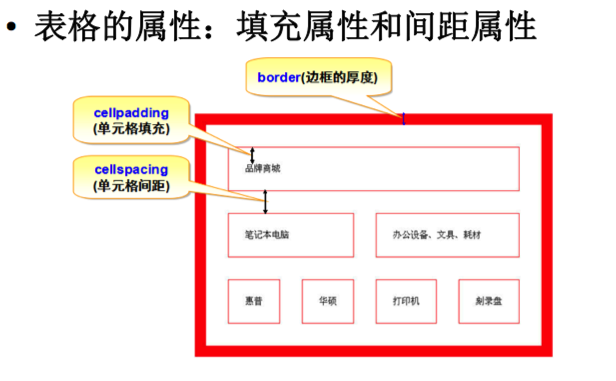
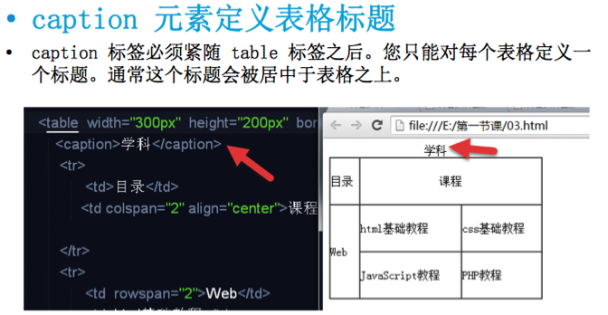

### 表格的标准结构 和 th 和 valign

<div>
   <!-- table的标准结构 -->
	<table border="1"  width="300" height="200">
	<thead>
		<tr>
			<th> thead 1</th>
			<th> thead 2</th>
		</tr>
	</thead>
	<tbody>
		<tr>
			<th valign="bottom"> tbody 1</th>
			<td valign="top"> tbody 2</td>
			<td> tbody 3</td>
		</tr>
	</tbody>
	<tfoot>
		<tr>
			<th> tfoot 01</th>
			<td> tfoot 01</td>
			<td> tfoot 02</td>
		</tr>
	</tfoot>
	</table>
</div>

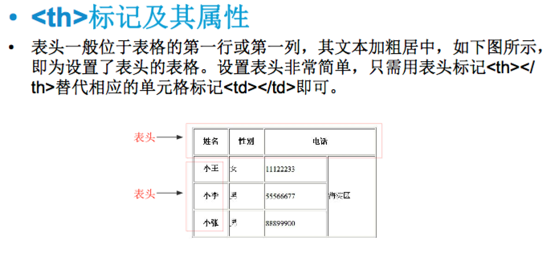


### 表格的合并

<div>
<table border="2" bordercolor="red" width="200" height="200">
		<tr>
			<td colspan="3"></td>
		</tr>
		<tr>
			<td valign="middle">张三</td>
			<td></td>
			<td rowspan="2"></td>
		</tr>
		<tr>
			<td></td>
			<td></td>
		</tr>
	</table>
</div>

### 细线表格

- 设置 cellspacing, 把 tr 背景色 设置为白色

<div>
<table width="400" height="200" bgcolor="green" cellspacing="2">
		<tr bgcolor="white">
			<td></td>
			<td></td>
			<td></td>
			<td></td>
		</tr>
		<tr bgcolor="white">
			<td></td>
			<td></td>
			<td></td>
			<td></td>
		</tr>
		<tr bgcolor="white">
			<td></td>
			<td></td>
			<td></td>
			<td></td>
		</tr>
		<tr bgcolor="white">
			<td></td>
			<td></td>
			<td></td>
			<td></td>
		</tr>
	</table>
</div>

### 细线课表

<div>
<table width="300" height="200" bgcolor="green" cellspacing="1" align="center">
	<caption>课程表</caption>
		<tr bgcolor="white">
			<th width="80" colspan="2"></th>
			<!-- <td></td> -->
			<th>星期一</th>
			<th>星期二</th>
			<th>星期三</th>
			<th>星期四</th>
			<th>星期五</th>
		</tr>
		<tr bgcolor="white">
			<th rowspan="2" width="50">上午</th>
			<td width="30">1</td>
			<td>语文</td>
			<td>语文</td>
			<td>语文</td>
			<td>语文</td>
			<td>语文</td>
		</tr>
		<tr bgcolor="white">
			<!-- <td></td> -->
			<td>2</td>
			<td>语文</td>
			<td>数学</td>
			<td>物理</td>
			<td>化学</td>
			<td>生物</td>
		</tr>
		<tr bgcolor="white">
			<th rowspan="2" height="50">下午</th>
			<td>3</td>
			<td>语文</td>
			<td>语文</td>
			<td>语文</td>
			<td>语文</td>
			<td>语文</td>
		</tr>
		<tr bgcolor="white">
			<!-- <td></td> -->
			<td>4</td>
			<td>语文</td>
			<td>语文</td>
			<td>语文</td>
			<td>语文</td>
			<td>语文</td>
		</tr>
	</table>
</div>

### 表单

<div>
	<form name="表格名字" action="POST" url="1.php">
		<fieldset>
			<legend>分组名称<legend>
			密码:<input type="password" name="pwd">
			<p>
			<!-- 重置按钮 -->
	   	      <input type="reset">
	   	      <!-- 文件提交按钮 -->
	   	       <input type="submit">
		</fieldset>
	</form>
</div>

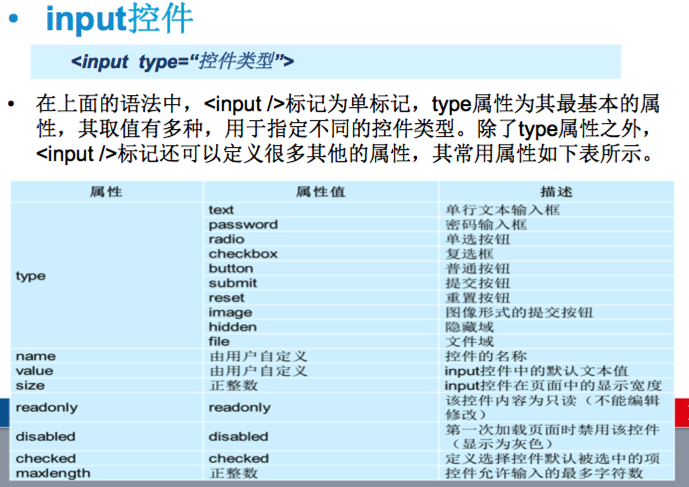

<div>
<!-- 文本输入框 -->
			用户名:<input type="text" maxlength="6"  name="username" value="大前端">
			<!-- 密码输入框 -->
			密码:<input type="password" name="pwd">
			<p>
				   <!-- 单选框 -->
	   <input type="radio" name="gender" id="mal" checked="checked"><label for="mal">男</label>
	   <input type="radio" name="gender" id="femal">
	   <label for="femal">女<label>

			</p>
		<input type="image" src="./images/Snip20180328_13.png" width="100" height="50"></input>	<div>
多选框<br>
	   	       <input type="checkbox" checked="checked" id="drink"><label for="drink"> 喝酒 </label>
	   	       <input type="checkbox" checked="checked" id="smoke"><label for="smoke"> 抽烟 </label>
	   	       <input type="checkbox" checked="checked" id="head"><label for="head"> 烫头 </label>
<div>
<!-- 文件上传控件 -->
	   	       <input type="file">
</div>

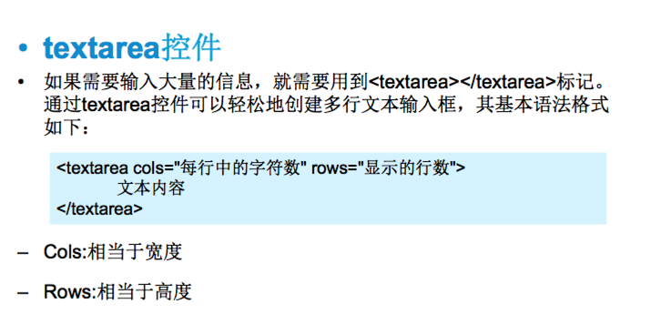

<div>
	<textarea cols="30" rows="3">
	</textarea>
</div>

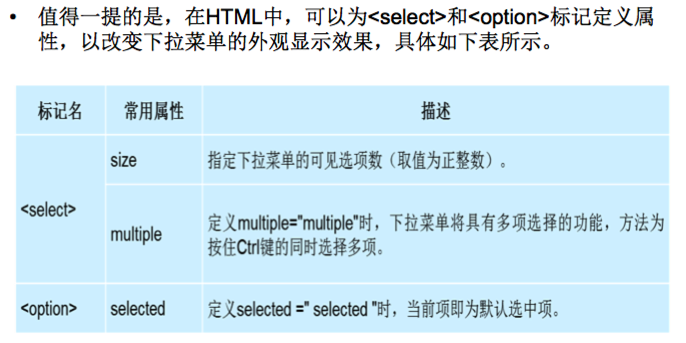

<div>
	<select>
		<option>河北</option>
		<option>山西</option>
		<option>山东</option>
		<option selected="selected">北京</option>
	</select>
</div>

<div>
	<select multiple>
		<option>河北</option>
		<option>山西</option>
		<option>山东</option>
		<option selected="selected">北京</option>
	</select>
</div>

<div>
	<select>
		<optgroup label="北方">
			<option>河北</option>
			<option>山西</option>
			<option>山东</option>
		</optgroup>
		<optgroup label="南方">
			<option>湖南</option>
			<option>湖南 </option>
			<option>湖南 </option>
		</optgroup>
	</select>
</div>

### h5 新特性

<div>
	<form action="1.php" method="post">
	网址控件
	<input type="url">
	日期控件
	<input type="date">
	时间控件
	<input type="time">
	邮件控件
	<input type="email">
	数字控件
	<input type="number" step="5">
	滑块控件
  <input type="range">

	<input type="submit">

	</form>
</div>
