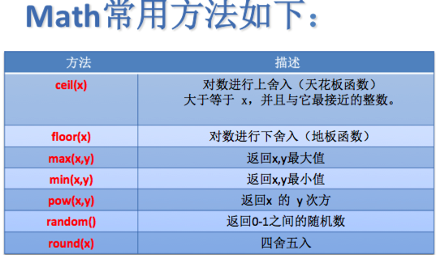
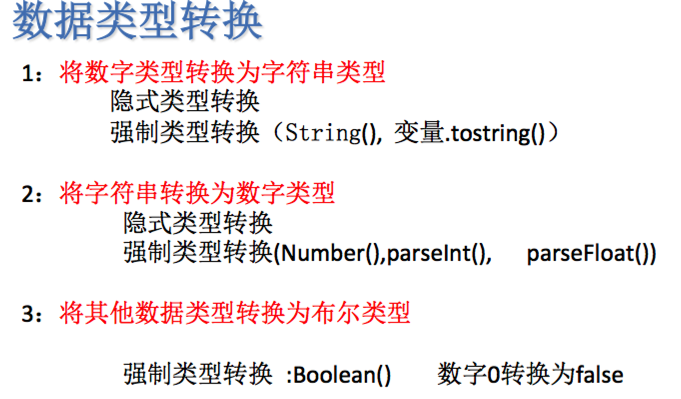

```
    // 确认
		alert("14期威武");
// 取消, 确认
		confirm("14期霸气");

		console.log("14期大气");
// 输入
<!--		prompt("请输入您的银行卡号");-->

// 写入
		document.write("14期<br><strong>老霸气了</strong>");
```

### Date

```
	var mydate=new Date();//通过new方法创建对象
	alert(Date()); // 返回一个完整的日期时间
	alert(mydate.getDay());//返回当前是周几
	alert(mydate.getMonth()+1);//返回当前月份
	alert(mydate.getFullYear());//返回当前年份
	alert(mydate.getHours());//返回当前小时
    alert(mydate.getMinutes());//返回当前分钟
    alert(mydate.getSeconds());//返回当前秒数
```




```
// 数组的合并
	var ary3=ary1.concat(ary2);

//join() 方法用于把数组中的所有元素放入一个字符串。
//元素是通过指定的分隔符进行分隔的。
// var ary1=[2,23,32,21,345,46,"中国人"];
// var ary2=ary1.join("&");
```
